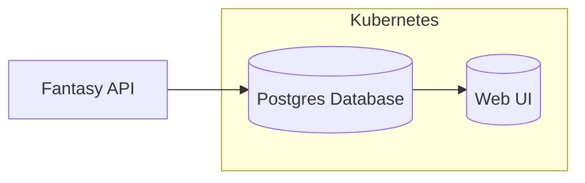

# Fantasy Football Analytics

This repo contains code for a data analytics project around fantasy football data.

## Proposed Architecture

The porposed architecture for the project will look like this:

